# User Management – Modernized

> This repository is an extended and modernised version of the original **User Management Technical Exercise**.
> This repo contains two UIs (Blazor WebAssembly **and** MVC) over a shared data & domain-services layer.  
> The original brief is preserved in **[OriginalREADME.md](./OriginalREADME.md)**.

## What’s inside

**Solution layout** (top-level projects):

- `UserManagement.Data` — EF Core DbContext, entities, migrations and seeding. Can run with **SQLite** (default when DB exists) or **In‑Memory** (fallback).
- `UserManagement.Services` — application/domain services (users, logs) with async APIs.
- `UserManagement.API` — ASP.NET Core Web API (JWT auth) used by the Blazor app.
- `UserManagement.BlazorWeb` — Blazor WebAssembly UI that talks to the API.
- `UserManagement.Web` — MVC/Razor (server‑rendered) UI that talks directly to Services.
- `UserManagement.Data.Tests` — unit tests for Data/Services/Web controllers.
- `.github/workflows/ci.yml` — GitHub Actions CI that restores, builds and runs tests.

## What’s new (highlights)

- **Blazor WebAssembly UI** with JWT auth, protected routes, and a login page.
- **Email + Password authentication** against users stored in the database.
- **Actions & logs**: create/view/edit/delete users; application-wide logs with paging & search; “Performed By” shows the current signed-in user.
- **Password support** in the `User` entity; masked in lists/details; show/hide on create/edit.
- **Async services** end-to-end (`UserService`, `UserLogService`, controllers, tests).
- **SQLite database + EF Core migrations** with automatic fallback to **InMemory** if a DB isn’t present.
- **Bundled static assets** (CSS/JS) via WebOptimizer.
- **Configuration-driven** API base URL (Blazor) and CORS (API).
- **Comprehensive tests** updated for async flows.
- **CI**: GitHub Actions workflow to restore, build, and test all projects.

---

## Solution layout

```
UserManagement.sln
├─ UserManagement.API/           # ASP.NET Core Web API (JWT, CORS) – used by Blazor
├─ UserManagement.BlazorWeb/     # Blazor WASM client (login, protected routes) – calls the API
├─ UserManagement.Web/           # MVC UI (does NOT call the API; uses Services directly)
├─ UserManagement.Data/          # EF Core DbContext + entities + seeding
├─ UserManagement.Services/      # Domain services (Users, Logs) used by API & MVC
├─ UserManagement.Data.Tests/    # Unit tests for data/services/controllers
└─ .github/workflows/ci.yml      # CI: build + test
```

> **Important:** `UserManagement.Web` (MVC) does **not** depend on `UserManagement.API`.  
> It consumes `UserManagement.Services`, which in turn uses `UserManagement.Data` (EF Core DbContext).  
> Blazor **does** call `UserManagement.API` over HTTP using a configurable base URL.

---

## Prerequisites

- .NET 9 SDK
- (Optional) Visual Studio 2022 / VS Code
- (Optional) `dotnet-ef` tool for migrations:
  ```bash
  dotnet tool install -g dotnet-ef
  ```

---

## Running the apps

### Configuration

**Blazor (WASM)** – `UserManagement.BlazorWeb/appsettings.json`
```json
{
  "Api": {
    "BaseUrl": "https://localhost:7144/api/"
  }
}
```

**API** – `UserManagement.API/appsettings.json` (examples)
```json
{
  "ConnectionStrings": {
    "Users": "Data Source=%CONTENTROOTPATH%/usersinfo.db"
  },
  "Cors": {
    "AllowedOrigins": [ "https://localhost:7074", "http://localhost:7074" ]
  },
  "Jwt": {
    "Issuer": "UserManagement",
    "Audience": "UserManagement.Client",
    "Key": "replace-with-a-long-random-secret",
    "ExpiresMinutes": 60
  }
}
```

> `%CONTENTROOTPATH%` becomes the app's content root at runtime.  
> If the SQLite file **doesn’t** exist, the data layer **falls back to InMemory** so the app still runs.

### Start projects

- **Blazor + API:** set both **UserManagement.API** and **UserManagement.BlazorWeb** as startup projects (or run with CLI).
- **MVC (no API needed):** set **UserManagement.Web** as startup (it uses `UserManagement.Services` directly).
- **Blazor + API + MVC:** set **UserManagement.API**, **UserManagement.BlazorWeb** and **UserManagement.Web** as startup projects (or run with CLI).

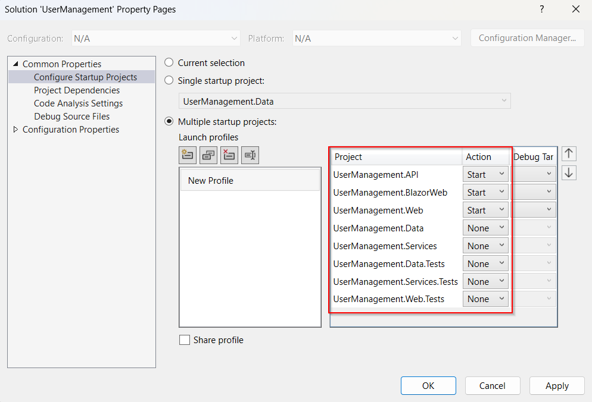

### Seeded login (Blazor → API)

- **Email:** `ploew@example.com`  
- **Password:** `mypassword1`

(Other seeded users share the same default password unless changed.)

---

## Database & migrations (SQLite with fallback)

By default we attempt to use the SQLite connection string. If the DB file is absent, we default to the EF **InMemory** database.

Create and apply migrations:
```bash
# Create the initial migration (if needed) (set Startup as UserManagement.API)
dotnet ef migrations add InitialCreate -p UserManagement.Data -s UserManagement.API

# Apply migrations (creates usersinfo.db next to API)
dotnet ef database update -p UserManagement.Data -s UserManagement.API
```

To reset: delete `usersinfo.db` and run the update again.

> We persist `UserLog.OccurredAt` with a value converter for SQLite so ORDER BY works correctly.

---

## Security & auth (Blazor + API)

- **POST /api/auth/login** with `{ "email": "...", "password": "..." }` returns a JWT.
- Token stored via an `ITokenStore` (browser storage).
- `JwtAuthStateProvider` drives Blazor `<AuthorizeRouteView>` and the navbar.
- API uses JWT bearer authentication & CORS based on config.

---

## Bundling & static files

Both UIs use **WebOptimizer**:

- CSS bundle: `/bundles/site.css`
- JS bundle: `/bundles/site.js`

Sources are set in each project’s `Program.cs`.

---

## Tests

- All tests use EF **InMemory** with a unique database name per test to avoid cross‑test interference.
- Controllers use **Moq** to verify calls and returned view models.

---

## CI (GitHub Actions)

`.github/workflows/ci.yml` runs on pushes/PRs to `main`:

- Restore, build (Release), test the solution
- Upload test results on failure (optional step included but disabled by default)

---

## Known tips

- If Blazor login fails with *“Failed to fetch”*, verify:
  - API is running at `https://localhost:7144/`
  - Blazor `Api:BaseUrl` matches (`https://localhost:7144/api/` – note trailing slash)
  - API CORS includes the Blazor origin (`https://localhost:7074`)
- To force InMemory for a run, temporarily rename or delete `usersinfo.db`.

---

## Original exercise brief

See **[OriginalREADME.md](./OriginalREADME.md)** for the original task list and context.

---

## Screenshots

### Blazor Web

| Page | Image |
|---|---|
| Home | 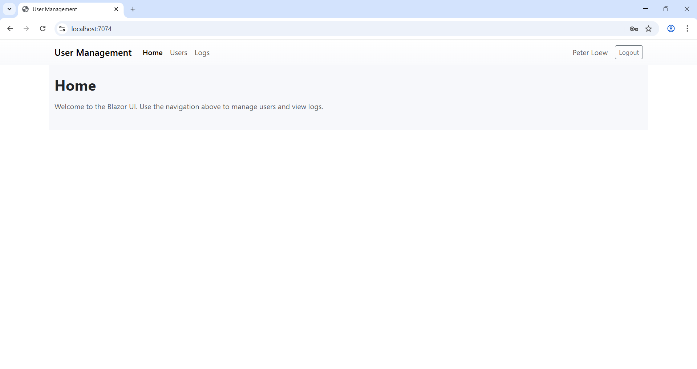 |
| Login | 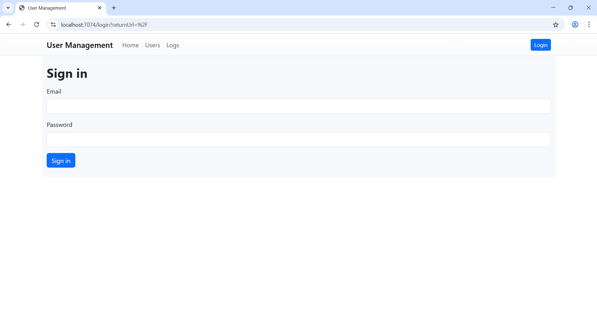 |
| Users | 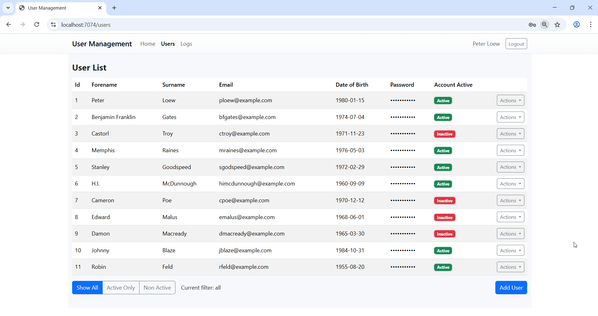 |
| Create User | 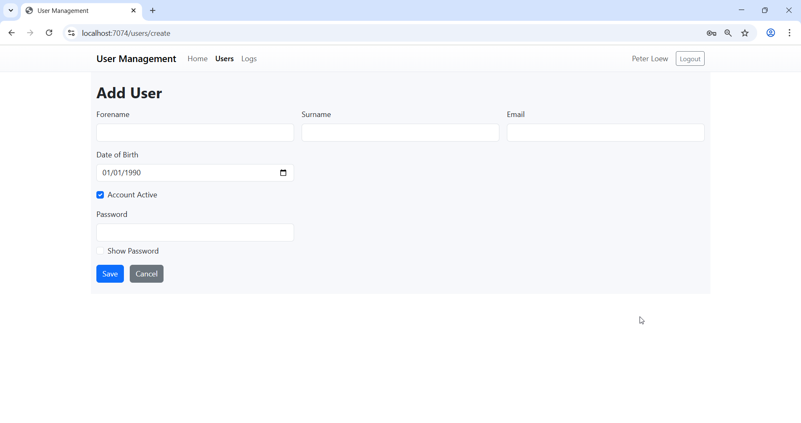 |
| Edit User | 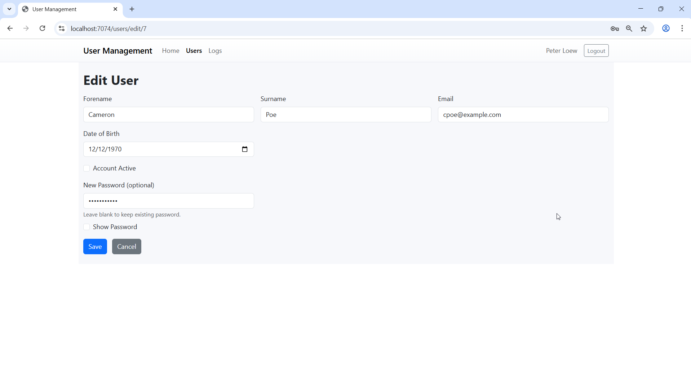 |
| Details | 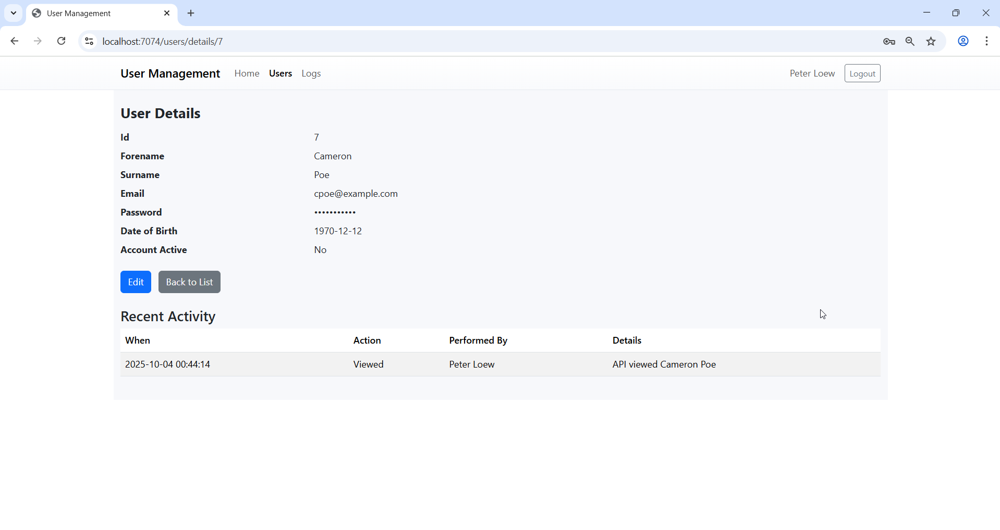 |
| Logs | 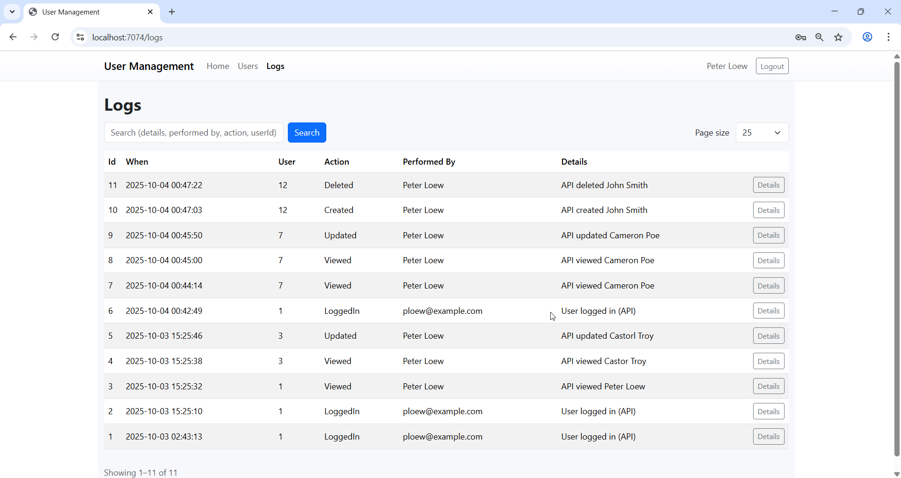 |
| Log Details | 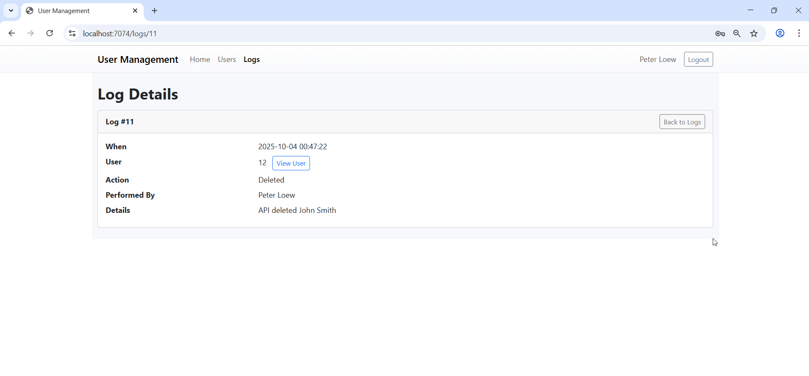 |

### MVC Web

| Page | Image |
|---|---|
| Home | 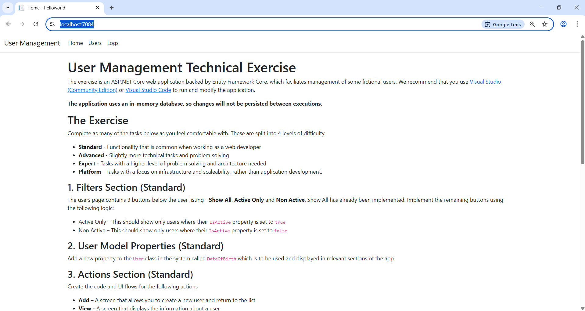 |
| Users | 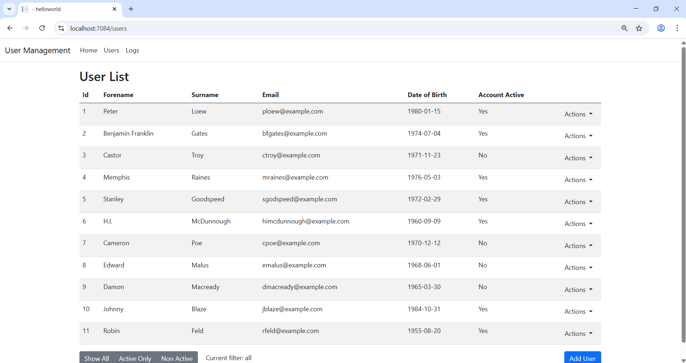 |
| Details | 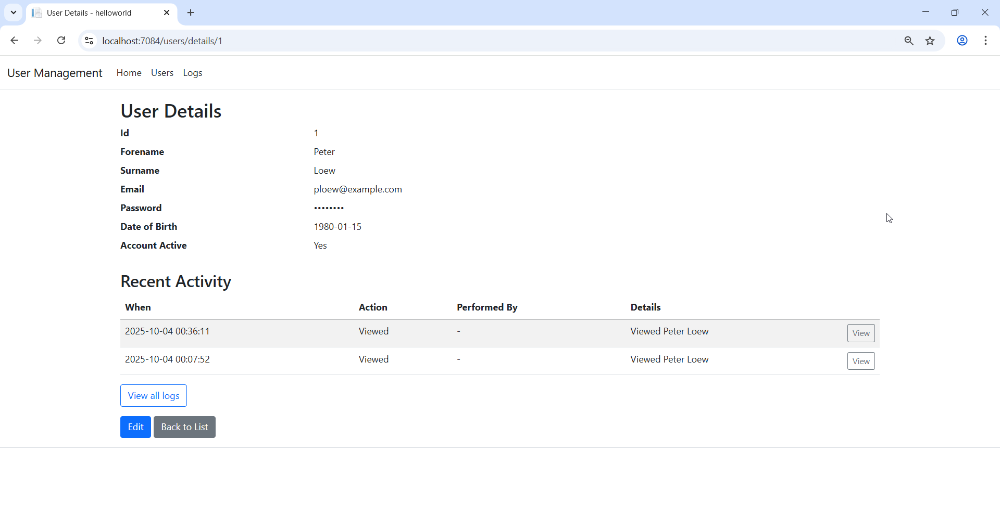 |
| Edit | 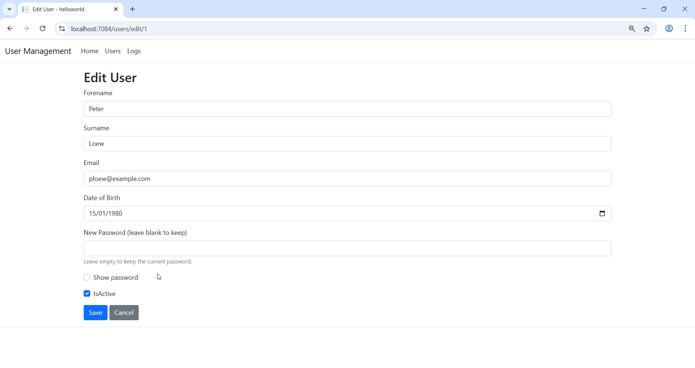 |
| Delete | 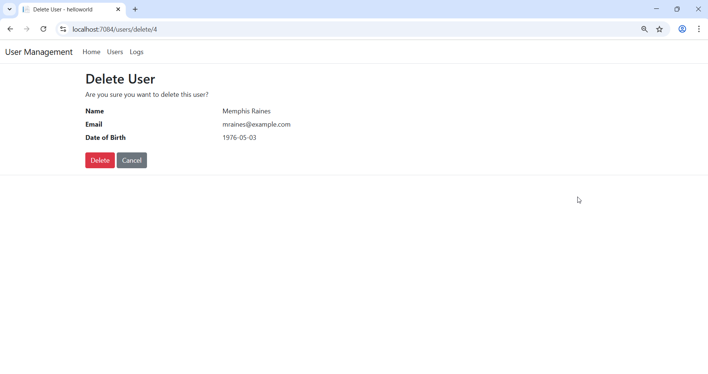 |
| Logs | 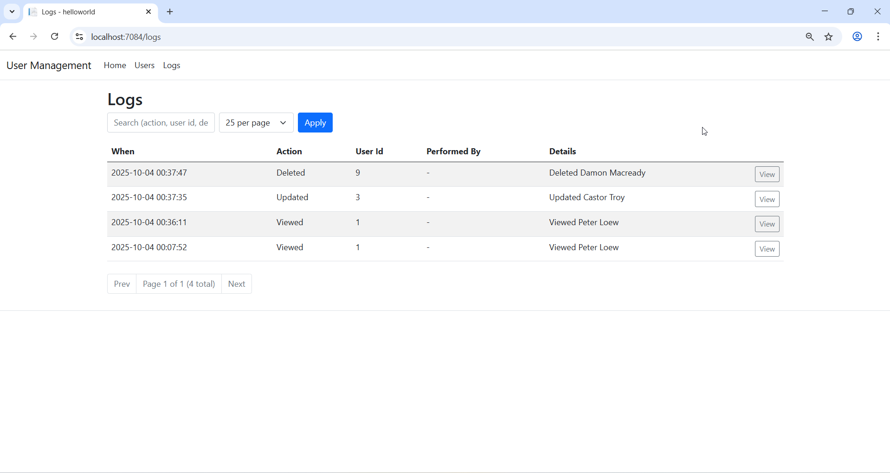 |
| Log Entry | 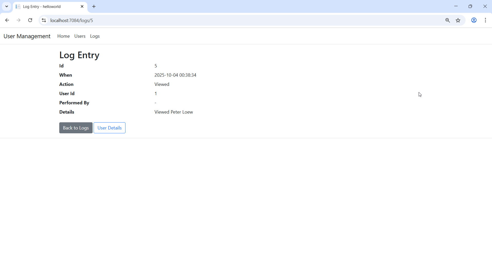 |

### API

- Swagger / Overview  
  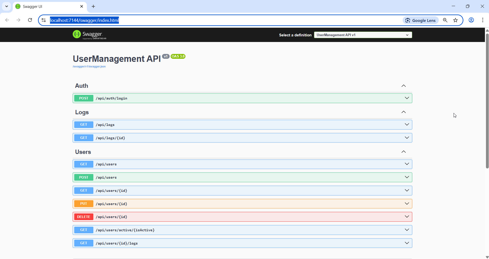